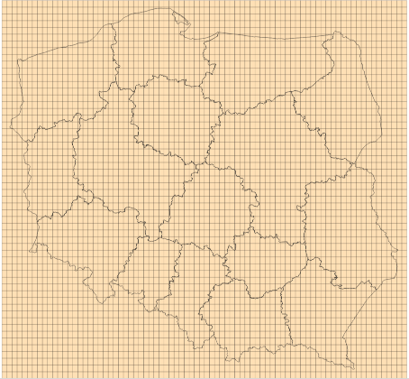
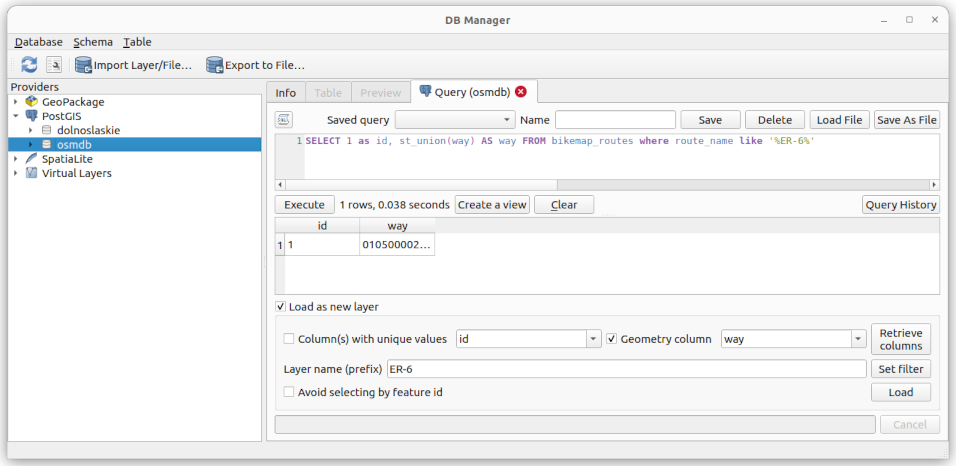
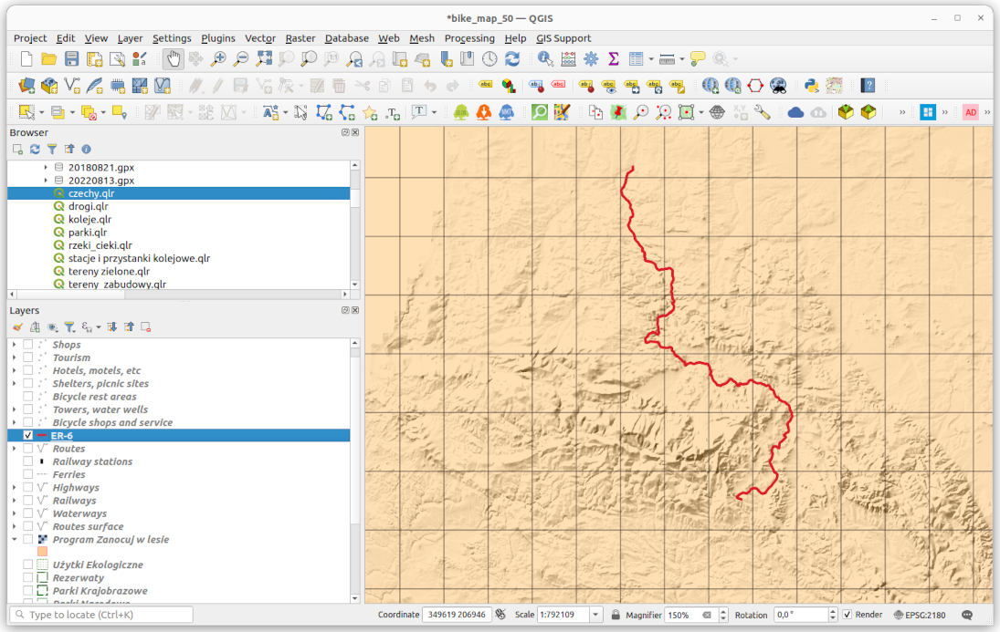
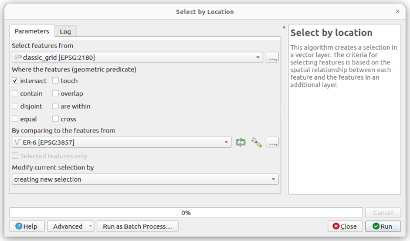
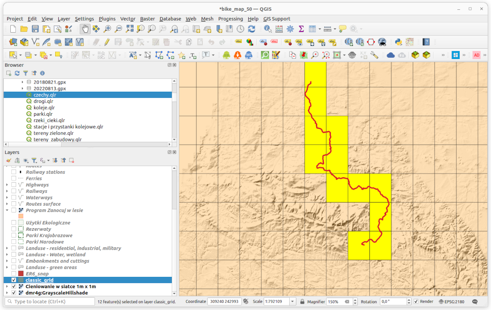
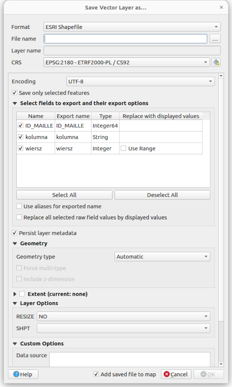
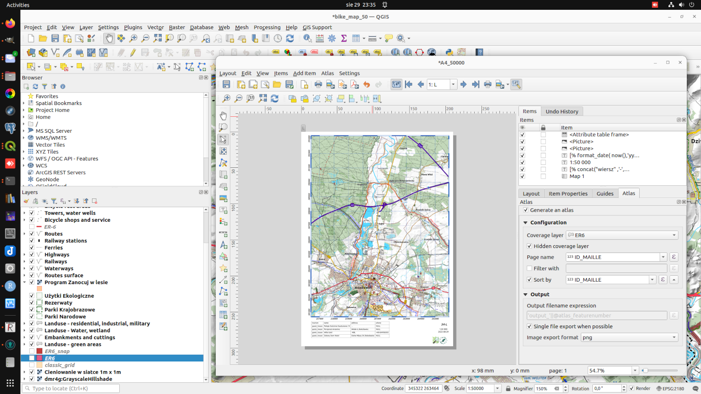

# Bike map
 
Bike map based on OSM data

I've been using this type of map for a while (the earliest printout I could find is from 2017), therefore I though it could be helpful to others. It employs "postgres," "postgis," and "QGIS" and is mostly based on [OpenStreetMap](https://www.openstreetmap.org/) data, which you may acquire from [Geofabrik](https://download.geofabrik.de/). The map's primary use is to be printed as an atlas on sheets of A4 paper (you can find QGIS Atlas features in project as well). The projection EPSG:2180 was utilized, and the base scale was 1:50 000. 

On the screenshot below, you can see how it appears.

## Data preparation

We will use `osm2pgsql`[^1] to import the OSM data, with a little modified style (added in osm2pgsql folder) as follows:

    osm2pgsql -c -U postgres -W -d osmdb --slim --hstore-all --style default.style --multi-geometry --merc poland-latest.osm.pbf

To build the necessary function(s) and views (stored in `sql/views.sql'), we must execute the `sql` script:

    psql -U postgres -W -d osmdb -f views.sql

I'm using extra online data sources for Poland:

* Background using raster relief information from [geoportal.gov.pl](https://www.geoportal.gov.pl/uslugi/usluga-przegladania-wms) as background;

* Vector boundary data from [GDOŚ](https://sdi.gdos.gov.pl/wfs?request=GetCapabilities&service=WFS) for nature reserves, parks etc;

* A WMS raster showing woodland regions where [Lasy Państwowe](https://www.bdl.lasy.gov.pl/portal/) allows visitors to camp overnight; 

## Data use, styling and reasons behind it

If my memory serves me well, it all began with Anita's Graser post about building Google-like maps using OSM data [^2]. Since then, it has undergone numerous versions, stylistic modifications, and icon, color, and detail tinkering.

The main reason behind the map is to have it printed out on hand, during bike trips. Therefore, such design suppositions: 

* must have:
    * cycle and foot routes
    * surface of the highways of the routes --- there is no pleasure to cycle with panniers over paving stones or sand :)
    * shelters, picnic sites, fire pits
    * bike shops / services and bike repair stations
    * stores and groceries, especially in rural areas
    * railways and railway station

* nice to have:
    * hotels, motels and other resting options
    * tourist attractions

### Landuse, nature reserve - polygons

The `planet_osm_polygon` table `landuse` field serves as te map's background. Details can be found in the views `bikemap_landuse`, `bikemap_water` and `bikemap_resind`. Although the styling is not sophisticated, I am using some symbols created by Yury Ryabov and Pavel Sergeev [^3] for bushes (and perhaps swamp areas).

There are addresses of forests allotments shown as well. You can download data from Lasy Państwowe geoportal, import it to database and create views. Please have a look on `forests.sh` script and views: `dlp_forests.sql`, `views_forest.sql`.

Over it we have few layers from GDOŚ with different types of nature reserve areas. If you would like to extract this type of data directly from OSM, please take a look on [`leisure=nature_reserve`](https://wiki.openstreetmap.org/wiki/Tag:leisure%3Dnature_reserve) and [`protect_class`](https://wiki.openstreetmap.org/wiki/Key:protect_class) keys.

### Highways, routes, cyclists infrastructure

tbc.

### Other points of interest

tbc.

## Atlas, how to generate

Sample atlas with coverage of few kilometers of ER-6 route in [img folder](./img/er6_snap.pdf). For atlas generation you can use `clasic_grid` layer, which consist of rectangular grid of dimmensions 9x12 km shown below.

There are several ways to choose the appropriate areas, either by `Select Features by Area or Single Click` option, or by `Select by Location` from `Vector -> Research Tool` menu --- that's my favorite one. Let's assume, we have to generate an atlas along ER-6 cycle route. We can use `DB Manager` to create the geometry and load it as a new layer:

After loading it looks like (for simplicity all other layers were unselected):

Using `Select by Location` tool:

we can easily get the required selection

and save it as a new layer.

Having new layer added (`ER6` in our case) we can open A4_50000 layout (`Layouts` from `Project` menu) and choose layer name in `Coverage layer` field in `Atlas` tab. Then you can preview Atlas, or export it as PDF.

## To do

-- exclude shops from the city areas? first check the assumption, if all city areas (admin_level = 8) has stores

-- new, simplified contours, based on https://land.copernicus.eu/imagery-in-situ/eu-dem/eu-dem-v1.1

-- simplify railways and multilane highways (https://gis.stackexchange.com/questions/319412/simplifying-multiple-lines-to-create-central-axis)

-- transpose railway stations on railway

## Footnotes

[^1]: [osm2pgsql](https://osm2pgsql.org/)
[^2]: see [anitagraser.com](https://anitagraser.com/2014/05/31/a-guide-to-googlemaps-like-maps-with-osm-in-qgis/)
[^3]: some symbols come from QGIS sybology set made by Yury Ryabov and Pavel Sergeev, available at [https://ssrebelious.wordpress.com/2011/10/11/qgis-symbology-set/](https://ssrebelious.wordpress.com/2011/10/11/qgis-symbology-set/)