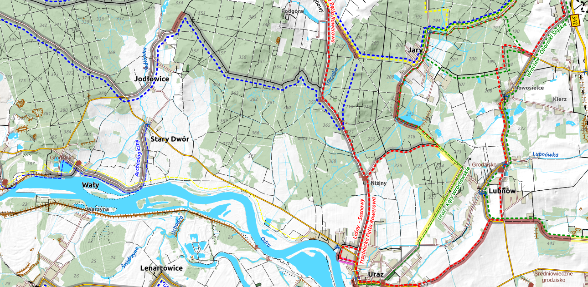

# bike_map_50
 
Bike map based on OSM data

Using this kind of map since a while (the earliest print out I have found are dated 2017), so I thought it can be useful to others. It's mainly based on [OpenStreetMap](https://www.openstreetmap.org/) data (you can download it from [Geofabrik](https://download.geofabrik.de/)), uses `postgres`, `postgis` and `QGIS`. The main purpose of the map is to be printed as atlas on A4 paper sheets (you can find QGIS Atlas features in project as well). The base scale is 1:50 000.

How it looks like you can see on the screenshot below.

## Data preparation

To use the OSM data we will use `osm2pgsql`[^1] with a slighty adopted style (added in osm2pgsql folder):

    osm2pgsql -c -U postgres -W -d osmdb --slim --hstore-all --style default.style --multi-geometry --merc poland-latest.osm.pbf

Then we have to run qsl script to create neccessary function(s) and views (stored in `sql/views.sql')

    psql -U postgres -W -d osmdb -f views.sql

For Poland, where I live, I'm using additional data sources:

* raster relief data from [geoportal.gov.pl](https://www.geoportal.gov.pl/uslugi/usluga-przegladania-wms) as background;

* vector boundary data for nature reserves, parks etc from [GDOŚ](https://sdi.gdos.gov.pl/wfs?request=GetCapabilities&service=WFS);

* WMS raster with forest areas where you can stay overnight in the wilderness [Lasy Państwowe](https://www.bdl.lasy.gov.pl/portal/);

## Data use, styling and reasons behind it

If I recall it correctly, it somewhat started with Anita's Graser post about creation of Google like maps with OSM data [^2]. Since then it went through a lot of iterations, styles changes, playing with icons, colors and details.

The main reason behind the map is to have it printed out on hand, during bike trips. Hence such design assumptions: 

* must have:
    * cycle and foot routes
    * surface of the highways of the routes --- there is no pleasure to cycle with panniers over paving stones or sand :)
    * shelters, picnic sites, fire pits
    * bike shops / services and bike repair stations
    * stores and groceries, especially in rural areas
    * railways and railway station

* nice to have:
    * hotels, motels and other resting options
    * tourist attractions

### Landuse, nature reserve - polygons

The background of the map consist of `landuse` taken from `planet_osm_polygon` table. You can find details in `bikemap_landuse`, `bikemap_water` and `bikemap_resind` views. Styling is not sofisticated, however for shrubs (and probably wetlands) I'm using some symbols prepared by Yury Ryabov and Pavel Sergeev [^3]. 

Over it we have few layers from GDOŚ with different types of nature reserve areas. If you would like to extract the data from OSM, please have a look on [`leisure=nature_reserve`](https://wiki.openstreetmap.org/wiki/Tag:leisure%3Dnature_reserve) and [`protect_class`](https://wiki.openstreetmap.org/wiki/Key:protect_class) keys.

## To do

-- exclude shops from the city areas? first check the assumption, if all city areas (admin_level = 8) has stores

-- simplify railways and multilane highways (https://gis.stackexchange.com/questions/319412/simplifying-multiple-lines-to-create-central-axis)

-- transpose railway stations on railway

## Footnotes

[^1]: [osm2pgsql](https://osm2pgsql.org/)
[^2]: see [anitagraser.com](https://anitagraser.com/2014/05/31/a-guide-to-googlemaps-like-maps-with-osm-in-qgis/)
[^3]: some symbols come from QGIS sybology set made by Yury Ryabov and Pavel Sergeev, available at [https://ssrebelious.wordpress.com/2011/10/11/qgis-symbology-set/](https://ssrebelious.wordpress.com/2011/10/11/qgis-symbology-set/)